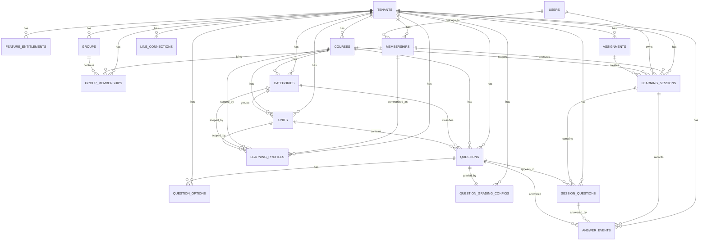

# ER図とテーブル定義たたき台

## 1. この文書の目的

この文書は、MVP実装に入る前に論理データモデルをER図とテーブル粒度へ落とし込むための草案です。
DB製品はまだ固定せず、PostgreSQL系を想定した命名と制約の置き方で整理します。

## 2. 設計方針

- Tenant配下のデータは原則 `tenant_id` を持つ
- `id` 単独参照より `tenant_id + id` を前提にアクセスできる設計を優先する
- User本人情報とTenant所属情報は分離する
- Question本体と採点設定は分離する
- LearningSessionを学習実行の中心とし、AnswerEventを一次ログとして残す
- 集計値は一次データから再計算可能な構造を優先する

## 3. ER図

## 4. 主要テーブル定義

### 4.1 tenants

役割:

- 契約組織の最上位単位

主要カラム:

- `tenant_id` `uuid` PK
- `tenant_key` `varchar(64)` UNIQUE
- `name` `varchar(255)`
- `status` `varchar(32)`
- `timezone` `varchar(64)`
- `locale` `varchar(16)`
- `plan_code` `varchar(64)`
- `created_at` `timestamptz`
- `updated_at` `timestamptz`

推奨制約:

- `tenant_key` unique
- `status` はアプリ側 enum と整合

### 4.2 users

役割:

- Tenantをまたぐ本人主体

主要カラム:

- `user_id` `uuid` PK
- `line_user_id` `varchar(128)` UNIQUE NULL
- `display_name` `varchar(255)`
- `photo_url` `text`
- `status` `varchar(32)`
- `created_at` `timestamptz`
- `updated_at` `timestamptz`

### 4.3 memberships

役割:

- UserとTenantの所属と権限

主要カラム:

- `membership_id` `uuid` PK
- `tenant_id` `uuid` FK -> tenants
- `user_id` `uuid` FK -> users
- `role` `varchar(32)`
- `status` `varchar(32)`
- `joined_at` `timestamptz`
- `last_accessed_at` `timestamptz`
- `created_at` `timestamptz`

推奨制約:

- `unique (tenant_id, user_id)`
- `index (tenant_id, role, status)`

### 4.4 groups

主要カラム:

- `group_id` `uuid` PK
- `tenant_id` `uuid` FK
- `name` `varchar(255)`
- `status` `varchar(32)`
- `created_at` `timestamptz`
- `updated_at` `timestamptz`

### 4.5 group_memberships

主要カラム:

- `group_membership_id` `uuid` PK
- `tenant_id` `uuid` FK
- `group_id` `uuid` FK
- `membership_id` `uuid` FK
- `created_at` `timestamptz`

推奨制約:

- `unique (tenant_id, group_id, membership_id)`

### 4.6 feature_entitlements

主要カラム:

- `feature_entitlement_id` `uuid` PK
- `tenant_id` `uuid` FK
- `feature_key` `varchar(64)`
- `enabled` `boolean`
- `limit_value` `integer` NULL
- `period_type` `varchar(32)` NULL
- `effective_from` `timestamptz`
- `effective_to` `timestamptz` NULL
- `created_at` `timestamptz`
- `updated_at` `timestamptz`

推奨制約:

- `unique (tenant_id, feature_key, effective_from)`

### 4.7 line_connections

主要カラム:

- `line_connection_id` `uuid` PK
- `tenant_id` `uuid` FK UNIQUE
- `channel_id` `varchar(128)`
- `channel_secret_ref` `varchar(255)`
- `channel_access_token_ref` `varchar(255)`
- `liff_id` `varchar(128)`
- `status` `varchar(32)`
- `created_at` `timestamptz`
- `updated_at` `timestamptz`

### 4.8 courses

主要カラム:

- `course_id` `uuid` PK
- `tenant_id` `uuid` FK NULL
- `source_type` `varchar(32)`
- `title` `varchar(255)`
- `description` `text`
- `status` `varchar(32)`
- `created_at` `timestamptz`
- `updated_at` `timestamptz`

補足:

- 共通教材を許容する場合は `tenant_id` NULL を許容する案と、共通Tenantを設ける案がある
- MVPでは `tenant_id` NULL + `source_type = COMMON` を暫定候補とする

### 4.9 categories

主要カラム:

- `category_id` `uuid` PK
- `tenant_id` `uuid` FK NULL
- `course_id` `uuid` FK
- `name` `varchar(255)`
- `sort_order` `integer`

### 4.10 units

主要カラム:

- `unit_id` `uuid` PK
- `tenant_id` `uuid` FK NULL
- `course_id` `uuid` FK
- `category_id` `uuid` FK
- `name` `varchar(255)`
- `sort_order` `integer`

### 4.11 questions

主要カラム:

- `question_id` `uuid` PK
- `tenant_id` `uuid` FK NULL
- `course_id` `uuid` FK
- `category_id` `uuid` FK
- `unit_id` `uuid` FK
- `question_type` `varchar(32)`
- `grading_type` `varchar(32)`
- `question_text` `text`
- `explanation` `text`
- `difficulty` `integer`
- `status` `varchar(32)`
- `required_feature_key` `varchar(64)` NULL
- `created_at` `timestamptz`
- `updated_at` `timestamptz`

推奨制約:

- `index (tenant_id, course_id, unit_id, status)`
- `index (question_type, grading_type)`

### 4.12 question_options

主要カラム:

- `question_option_id` `uuid` PK
- `tenant_id` `uuid` FK NULL
- `question_id` `uuid` FK
- `option_key` `varchar(64)`
- `label` `text`
- `sort_order` `integer`

推奨制約:

- `unique (question_id, option_key)`

### 4.13 question_grading_configs

主要カラム:

- `question_grading_config_id` `uuid` PK
- `tenant_id` `uuid` FK NULL
- `question_id` `uuid` FK UNIQUE
- `answer_schema` `jsonb`
- `correct_answer_payload` `jsonb`
- `tolerance` `numeric(10,4)` NULL
- `max_score` `integer`
- `rubric_payload` `jsonb` NULL
- `created_at` `timestamptz`
- `updated_at` `timestamptz`

### 4.14 assignments

主要カラム:

- `assignment_id` `uuid` PK
- `tenant_id` `uuid` FK
- `course_id` `uuid` FK
- `target_type` `varchar(32)`
- `target_id` `uuid`
- `question_count` `integer`
- `start_at` `timestamptz`
- `due_at` `timestamptz`
- `created_by_membership_id` `uuid` FK
- `status` `varchar(32)`
- `created_at` `timestamptz`
- `updated_at` `timestamptz`

推奨制約:

- `index (tenant_id, target_type, target_id, status)`

### 4.15 learning_sessions

主要カラム:

- `learning_session_id` `uuid` PK
- `tenant_id` `uuid` FK
- `user_id` `uuid` FK
- `membership_id` `uuid` FK
- `course_id` `uuid` FK NULL
- `assignment_id` `uuid` FK NULL
- `session_type` `varchar(32)`
- `status` `varchar(32)`
- `question_count` `integer`
- `started_at` `timestamptz` NULL
- `completed_at` `timestamptz` NULL
- `expires_at` `timestamptz` NULL
- `created_at` `timestamptz`

推奨制約:

- `index (tenant_id, membership_id, session_type, created_at desc)`
- `index (tenant_id, status, expires_at)`

MVP運用ルール:

- Daily Sessionは原則 `tenant_id + membership_id + session_type + business_date` 相当で一意に扱う
- `business_date` を持つ場合は後日追加してよい

### 4.16 session_questions

主要カラム:

- `session_question_id` `uuid` PK
- `tenant_id` `uuid` FK
- `learning_session_id` `uuid` FK
- `question_id` `uuid` FK
- `display_order` `integer`
- `question_snapshot_payload` `jsonb` NULL
- `created_at` `timestamptz`

推奨制約:

- `unique (learning_session_id, display_order)`

### 4.17 answer_events

主要カラム:

- `answer_event_id` `uuid` PK
- `tenant_id` `uuid` FK
- `learning_session_id` `uuid` FK
- `session_question_id` `uuid` FK
- `question_id` `uuid` FK
- `user_id` `uuid` FK
- `membership_id` `uuid` FK
- `attempt_no` `integer`
- `idempotency_key` `varchar(128)`
- `answer_payload` `jsonb`
- `is_correct` `boolean`
- `score` `integer`
- `elapsed_ms` `integer`
- `hint_used` `boolean`
- `explanation_viewed` `boolean`
- `answered_at` `timestamptz`
- `synced_at` `timestamptz` NULL

推奨制約:

- `unique (tenant_id, learning_session_id, idempotency_key)`
- `index (tenant_id, membership_id, answered_at desc)`
- `index (tenant_id, question_id, answered_at desc)`

### 4.18 learning_profiles

主要カラム:

- `learning_profile_id` `uuid` PK
- `tenant_id` `uuid` FK
- `user_id` `uuid` FK
- `membership_id` `uuid` FK
- `course_id` `uuid` FK NULL
- `category_id` `uuid` FK NULL
- `unit_id` `uuid` FK NULL
- `accuracy_rate` `numeric(5,2)`
- `recent_accuracy_rate` `numeric(5,2)`
- `average_elapsed_ms` `integer`
- `review_count` `integer`
- `last_learned_at` `timestamptz`
- `updated_at` `timestamptz`

推奨制約:

- `unique (tenant_id, membership_id, course_id, category_id, unit_id)`

## 5. Enum候補

### 5.1 tenant_status

- `ACTIVE`
- `SUSPENDED`
- `ARCHIVED`

### 5.2 membership_role

- `TENANT_OWNER`
- `TENANT_ADMIN`
- `INSTRUCTOR`
- `LEARNER`

### 5.3 membership_status

- `ACTIVE`
- `INVITED`
- `SUSPENDED`

### 5.4 source_type

- `COMMON`
- `TENANT`

### 5.5 question_type

- `TEXT_EXACT`
- `SINGLE_CHOICE`
- `MULTIPLE_CHOICE`
- `TRUE_FALSE`
- `NUMBER`
- `ORDER`
- `MATCHING`
- `SHORT_ANSWER`
- `LONG_ANSWER`

### 5.6 grading_type

- `AUTO`
- `MANUAL`
- `AI`
- `AI_WITH_REVIEW`

### 5.7 session_type

- `DAILY`
- `EXTRA`
- `REVIEW`
- `ASSIGNMENT`
- `COURSE`
- `EXAM`

### 5.8 session_status

- `CREATED`
- `IN_PROGRESS`
- `COMPLETED`
- `EXPIRED`

## 6. 集計方針の初期案

- 学習履歴画面の集計は、初期は `answer_events` から都度または軽い集計テーブルで算出する
- `learning_profiles` は即時更新でも非同期更新でもよいが、MVPでは更新戦略を単純化する
- Home用サマリと管理者一覧用サマリは、必要に応じて別クエリにする

## 7. 未確定事項

- 共通教材の `tenant_id` を NULL にするか、共通Tenantを設けるか
- Daily Session に `business_date` を持たせるか
- `assignment_targets` のような中間テーブルをMVPで先に切るか
- `learning_profiles` をMVPで実テーブル化するか、後から追加するか

## 8. 次の実装につなぐ最小DDL優先順

1. `tenants`
2. `users`
3. `memberships`
4. `feature_entitlements`
5. `line_connections`
6. `courses`
7. `categories`
8. `units`
9. `questions`
10. `question_options`
11. `question_grading_configs`
12. `learning_sessions`
13. `session_questions`
14. `answer_events`
15. `assignments`
